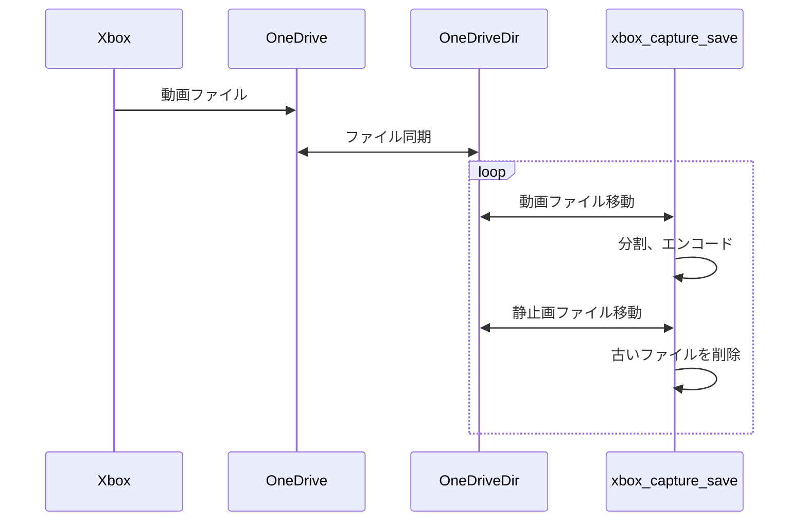

# xbox_capture_save
* Xboxではキャプチャした動画や静止画をOneDriveに保存でき
* しかしOneDriveは5GBしかないのですぐに溜まって消すのが面倒
* WindowsではOneDriveと同期する設定がありWindows側の通常のファイル操作でOneDriveからファイルをコピーしたり消すことができる
* そこで同期したOneDriveからWindows側の通常のディレクトリに移動することでOneDriveのファイルを消す
* さらにBlueskyなどにアップロードしたいのでついでに自動で60秒未満のファイルに分割し圧縮する
* この操作にはおそらくWindowsだけで完結できるが、慣れているためGit Bashを前提とした

## 概要

* One Driveに転送されたXboxの動画ファイルを別のディレクトリに移動する
  * 移動した動画ファイルをBluesky向けに分割する
* One Driveに転送されたXboxの静止画ファイルを別のディレクトリに移動する
* 古いファイルを削除する